# Field Atlas

A five-level study app for learning all 50 U.S. states and capitals — built as a single self-contained web app that installs like a native app on your phone's home screen.

### 🗺️ [**Try Field Atlas now →**](https://daeberly.github.io/50-state-capitals/)
No install, no signup, no app store — just open the link and start quizzing. Takes 30 seconds to add to your home screen (see below) so it feels and works like any other app on your phone.

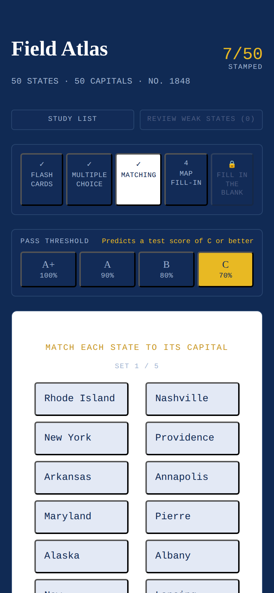

## How it works

You move through **five levels**, each one harder than the last. Every level needs a passing score to unlock the next:

| # | Level | What it tests |
|---|-------|----------------|
| 1 | **Flash Cards** | Self-graded recall — flip the card, mark "Knew It" or "Didn't Know" |
| 2 | **Multiple Choice** | Pick the right capital from 4 options (wrong answers are pulled from *nearby* states, so it's genuinely testing recognition, not just guessing) |
| 3 | **Matching** | Match states to capitals in sets of 10 — works in either order (tap the state first or the capital first) |
| 4 | **Map Fill-In** | A real U.S. map highlights the state; you type the capital |
| 5 | **Fill in the Blank** | Just the state name, no aids — pure recall |

You choose how strict "passing" is, framed as a school grade:

- **A+** (100%), **A** (90%), **B** (80%), or **C** (70%)

Whichever you pick becomes the bar for unlocking the next level — so passing at the "B" setting tells you that if you took a real test on this material right now, you'd probably score a B or better.

## Screenshots

### Level 1 — Flash Cards
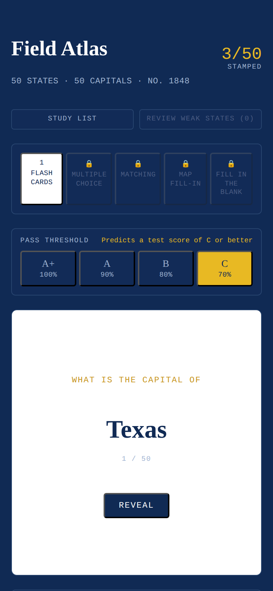

### Level 2 — Multiple Choice
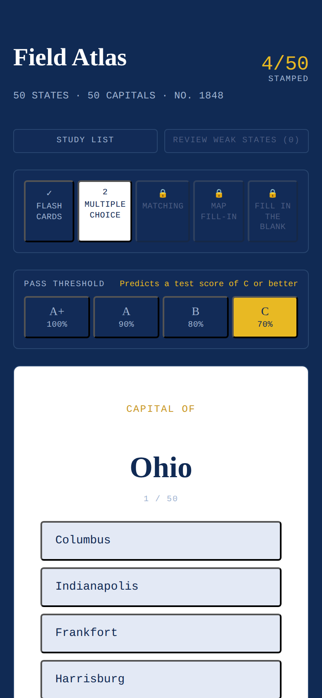

### Level 3 — Matching
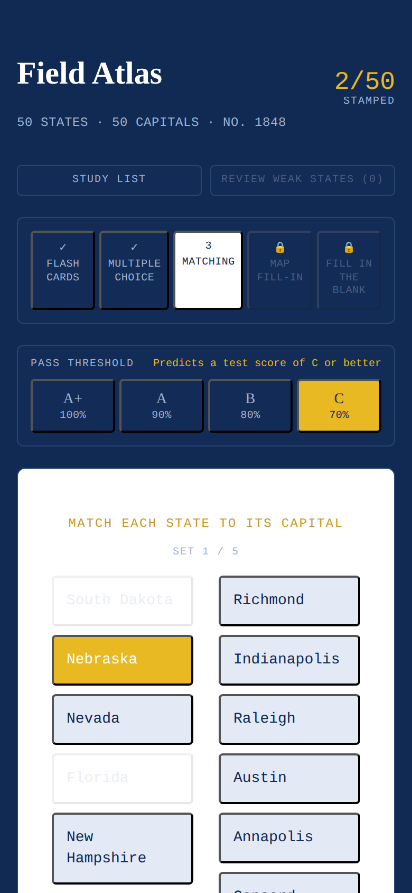

### Level 4 — Map Fill-In
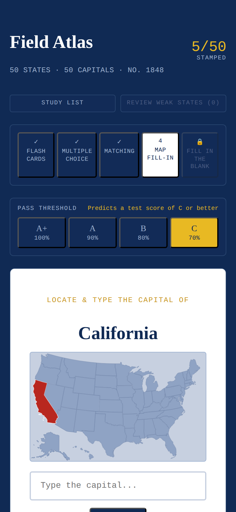

### Level 5 — Fill in the Blank
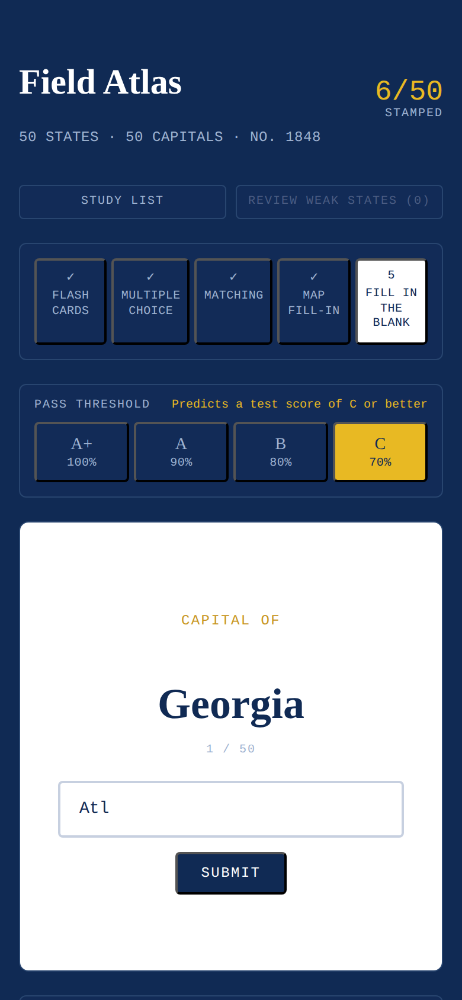

### Study List
A plain alphabetical list of all 50 state/capital pairs, for cramming before you quiz.

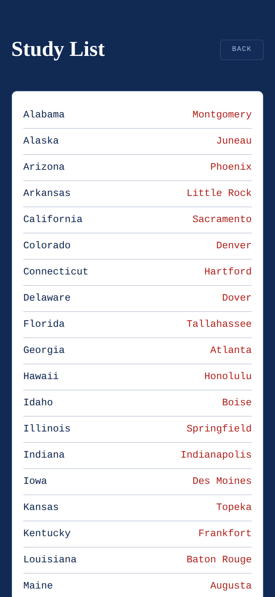

### Review Weak States
A focused round built from your 10 most-missed states, ranked by how often you've gotten them wrong.

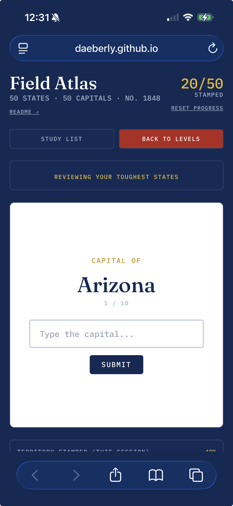
<!-- TODO: add screenshots/weak-states-review.png — capture the review round in progress (e.g. after missing a few states) and drop it in the screenshots/ folder -->

## Other features

- **Territory Stamped tracker** — a passport-style progress strip at the bottom fills in as you answer correctly, resetting fresh at the start of each level.
- **Review Weak States** — every wrong answer is quietly logged in the background, across all levels. Once you've missed anything, a "Review Weak States" button appears next to Study List, showing a live count. Tapping it pulls your 10 most-missed states (ranked by miss count) into a focused fill-in-the-blank round; a "Back to Levels" button takes you back to your regular progress whenever you're done.
- **Progress is saved automatically** — your level, unlocks, pass-threshold setting, and stamps all persist between visits (stored locally on your device, nothing sent anywhere).
- **Reset Progress** — a small link under the stamp counter wipes your saved state (unlocked levels, stamps, and weak-state history) and starts you back at Level 1. It asks for confirmation first, then reloads the app.
- **Sound + haptic feedback on correct answers** — a tone plus a light buzz/tap confirms you got it right. Haptics use `navigator.vibrate` where it's supported (Android); on iPhone, Safari has no vibration API at all, so the app uses an unofficial workaround (toggling a hidden native switch) to get a system haptic tick on iOS 18+. It's a hack, not an official API, so it may stop working in a future iOS release — see the note in [Running it yourself](#running-it-yourself). Wrong answers only get the sound, no vibration.
- Works as an installed home-screen app — see below.

## Install it on your iPhone

Field Atlas isn't in the App Store, but adding it to your home screen takes about 30 seconds and makes it behave exactly like a native app — its own icon, full screen, no Safari address bar.

1. Open **[the app](https://daeberly.github.io/50-state-capitals/)** in **Safari** (this only works in Safari, not Chrome or other iOS browsers), then tap the **Share** icon in the toolbar (the square with an arrow pointing up — circled below):

   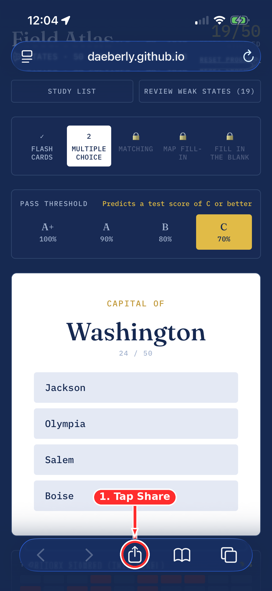

2. In the share sheet, scroll the icon row or tap **Options** to reveal more actions, then tap **Add to Home Screen**:

   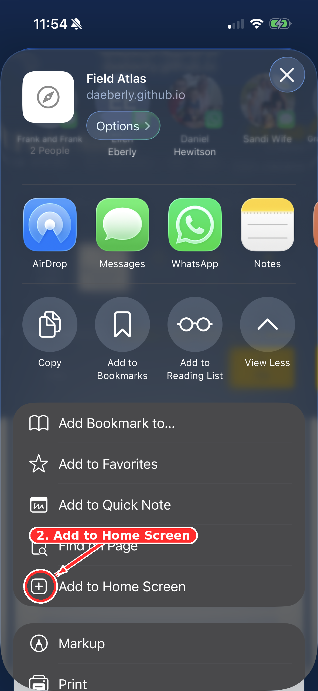

3. Confirm the name ("Field Atlas") and tap **Add** in the top-right corner. Leave **Open as Web App** turned on — that's what gives you the full-screen experience instead of opening inside Safari:

   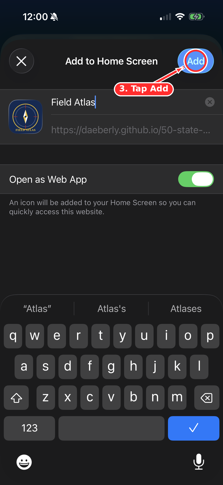

4. The app icon now sits on your home screen like any other app — tap it to launch:

   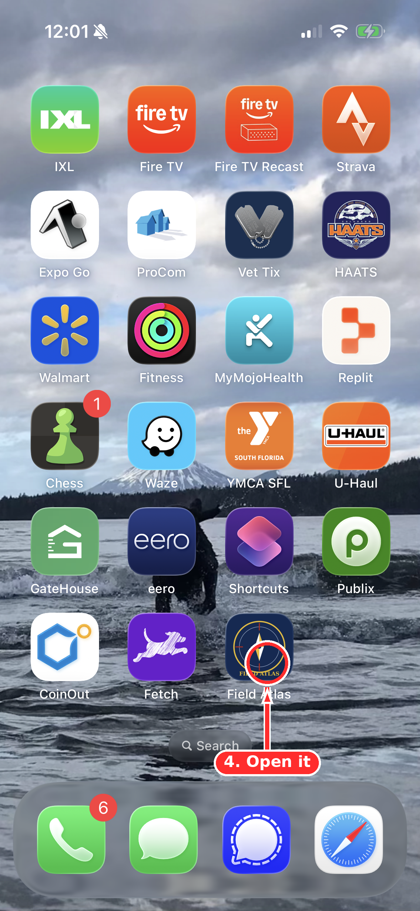

5. It opens full screen, no browser chrome, no address bar:

   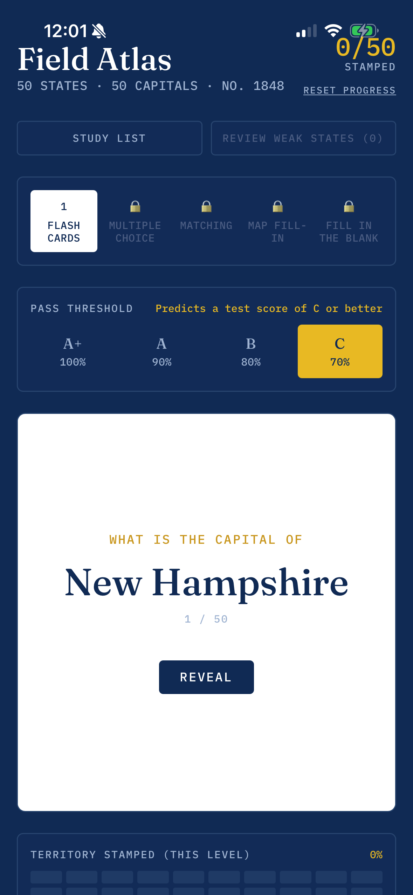

## Install it on Android

Field Atlas now ships a `manifest.json`, so Android gets a proper installable experience too:

1. Open **[the app](https://daeberly.github.io/50-state-capitals/)** in **Chrome**.
2. Tap the **⋮** menu → **Add to Home Screen** (or **Install app**, if Chrome offers it directly).
3. Confirm the name and tap **Add** / **Install**.
4. The app icon appears on your home screen and launches full screen — no address bar, same as iPhone.

A couple of honest caveats:
- The manifest gives Chrome everything it needs for standalone display (name, icons, `display: standalone`), but there's no service worker, so it won't work offline and may not trigger Chrome's automatic "install" banner on every device — the manual **Add to Home Screen** step above always works, though.
- The icon isn't a dedicated "maskable" icon (no safe-zone padding), so depending on the launcher, Android may crop its corners into a circle or squircle rather than showing it exactly as designed.

## Running it yourself

This is a static site with no build step — `index.html`, `manifest.json`, and two icon files (`icon-192.png`, `icon-512.png`). To host your own copy:

1. Fork or download this repository.
2. Upload `index.html`, `manifest.json`, `icon-192.png`, and `icon-512.png` (all in the same folder) to a static host — the simplest option is **GitHub Pages**:
   - Repo → **Settings → Pages** → set Source to your branch, folder `/ (root)` → Save.
   - Your app will be live at `https://<your-username>.github.io/<repo-name>/`.
3. Open that URL on your phone and add it to your home screen — see [Install it on your iPhone](#install-it-on-your-iphone) or [Install it on Android](#install-it-on-android) above for the exact steps.

The app pulls React and Tailwind from a CDN on first load (so it needs internet the very first time), then runs entirely client-side after that — no server, no database, no account required.

**A note on iOS haptics:** iOS Safari has never implemented the standard Vibration API, so correct-answer haptics on iPhone rely on an unofficial trick (a hidden `<input type="checkbox" switch>` toggled via a real tap, which iOS 18+ gives a system haptic tick for). This only fires on correct answers by design, requires a genuine tap to work, and — because it's undocumented behavior rather than a supported API — could break in a future iOS update with no warning. If haptics ever stop working after an iOS update, that's most likely why.

## Credits

- State boundary map data adapted from the MIT-licensed [Interactive and Responsive SVG Map of US States and Capitals](https://github.com/WebsiteBeaver/interactive-and-responsive-svg-map-of-us-states-capitals) by David Marcus / Website Beaver.
- Built with React and Tailwind CSS.
