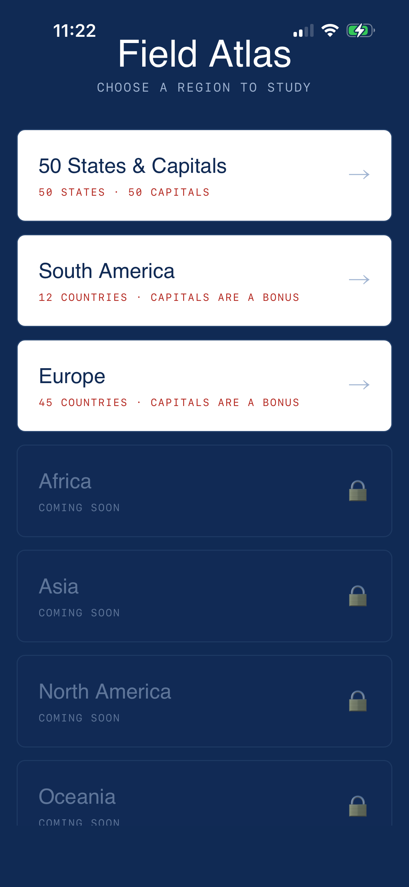
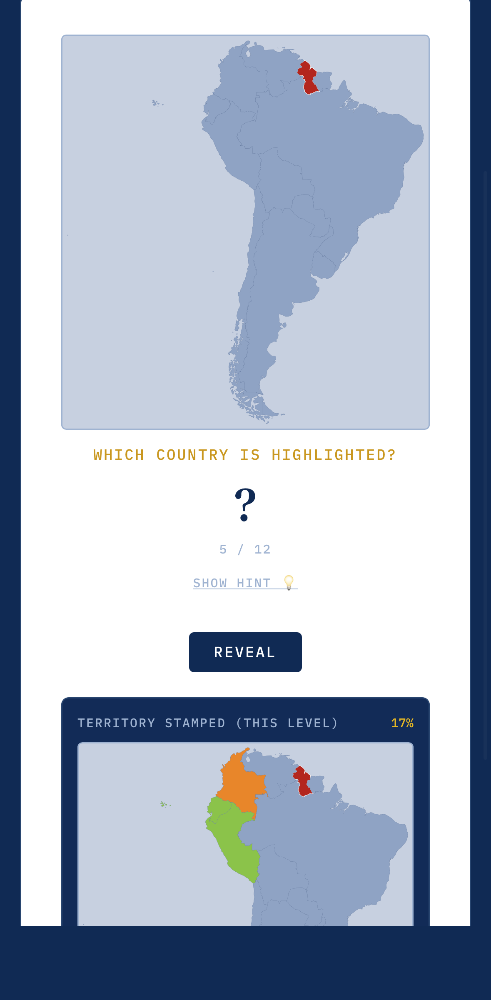
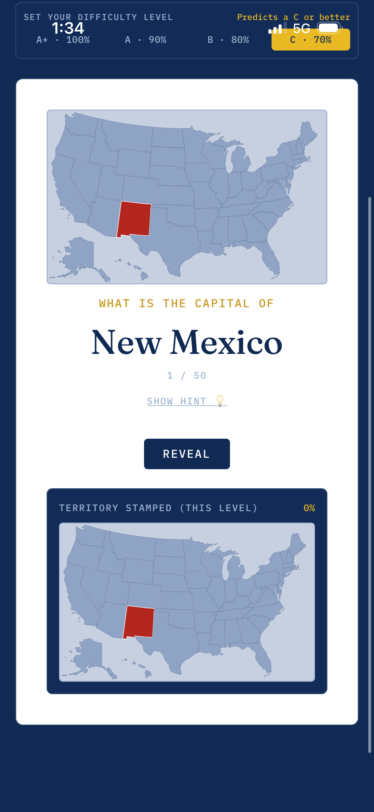

#  Field Atlas

A geography study app — learn all 50 U.S. states and capitals, plus countries and capitals around the world — built as a single self-contained web app that installs like a native app on your phone's home screen.

### 🗺️ [**Try Field Atlas now →**](https://daeberly.github.io/50-state-capitals/)
No install, no signup, no app store — just open the link and start quizzing. Takes 30 seconds to add to your home screen (see below) so it feels and works like any other app on your phone.

## Choose your region

Field Atlas now opens to a picker instead of going straight into the states quiz. Tap a region to start studying it — your progress is tracked separately for each one, so switching between regions never mixes up your stats.

- **50 States & Capitals** — the original, fully built out.
- **South America** and **Europe** — countries and capitals, ready to study now.
- **Africa, Asia, North America, Oceania** — shown as "Coming Soon" for now, more on the way.

## How it works

You move through **five levels**, each one harder than the last. Every level needs a passing score to unlock the next — and this now includes Flash Cards too, so hitting your target score matters on every level, not just some of them.

**States** and **world regions (South America, Europe, etc.)** are quizzed a little differently, matched to what's actually useful to learn for each:

| # | Level | States asks... | World regions ask... |
|---|-------|-----------------|------------------------|
| 1 | **Flash Cards** | the capital of the highlighted state | you to name the highlighted country (capital shown as a bonus on the flip side) |
| 2 | **Multiple Choice** | the capital, from 4 options pulled from *nearby* states | the country name, from 4 options pulled from *neighboring* countries |
| 3 | **Matching** | states to capitals, in sets of 10 | countries to capitals, in sets of 10 (a bonus round — see below) |
| 4 | **Map Fill-In** | you locate the state and type its capital | you locate the country and type its name |
| 5 | **Fill in the Blank** | just the state name, no aids | just the country's outline alone, zoomed in with no neighboring countries for context — the hardest level |

The idea for world regions: **learning where a country is and what it's called comes first — its capital is a nice bonus**, not the main event. States mode stays capital-focused throughout, same as it's always been.

Every level — not just Map Fill-In — now shows a small live map with the current state or country highlighted, so you always have a visual reference while you think. Tiny countries (Vatican City, Monaco, Andorra, etc.) get an extra target-ring marker so they don't disappear at map scale.

You choose how strict "passing" is, framed as a school grade — now a compact one-line row under **Set Your Difficulty Level**:

- **A+** (100%), **A** (90%), **B** (80%), or **C** (70%)

Whichever you pick becomes the bar for unlocking the next level — so passing at the "B" setting tells you that if you took a real test on this material right now, you'd probably score a B or better.

## Screenshots

### Level 1 — Flash Cards

### Level 2 — Multiple Choice

### Level 3 — Matching

### Level 4 — Map Fill-In

### Level 5 — Fill in the Blank

### Study List
A plain alphabetical list of state/country and capital pairs, with a hint for each — great for cramming before you quiz. World regions also get a "How to Remember These" tip at the top with a memory strategy for that region (e.g. grouping Europe by corner, or picturing South America as an ice-cream cone).

Here's a world region's Study List, showing the "How to Remember These" mnemonic at the top:

### Review Weak States
A focused round built from your 10 most-missed states or countries, ranked by how often you've gotten them wrong.

## Other features

- **The progress map replaces the old passport-style stamp strip** — it's now an actual map of the region, filling in as you go: **green** for anything you've gotten right, **orange** for anything you've missed at least once but haven't nailed yet, and the current question highlighted in red. One glance shows exactly what you've got down and what still needs work.

  

- **Review Weak States** — every wrong answer is quietly logged in the background, across all levels. Once you've missed anything, a "Review Weak States" button appears next to Study List, showing a live count. Tapping it pulls your 10 most-missed states/countries (ranked by miss count) into a focused round; a "Back to Levels" button takes you back to your regular progress whenever you're done.
- **How This Works** — a small link in the app header opens this README, so help is always one tap away.
- **Progress is saved automatically, per region** — your level, unlocks, difficulty setting, and stamped map all persist between visits (stored locally on your device, nothing sent anywhere). Studying South America doesn't touch your States progress, and vice versa.
- **Reset Progress** — a small link under the stamp counter wipes that region's saved state (unlocked levels, stamped map, and weak-item history) and starts it back at Level 1. It asks for confirmation first, then reloads.
- **Sound + haptic feedback on correct answers** — a tone plus a light buzz/tap confirms you got it right. Haptics use `navigator.vibrate` where it's supported (Android); on iPhone, Safari has no vibration API at all, so the app uses an unofficial workaround (toggling a hidden native switch) to get a system haptic tick on iOS 18+. It's a hack, not an official API, so it may stop working in a future iOS release — see the note in [Running it yourself](#running-it-yourself). Wrong answers only get the sound, no vibration — and stay on screen long enough to actually read and remember the correct answer before moving on.
- Works as an installed home-screen app — see below.

## Install it on your iPhone

Field Atlas isn't in the App Store, but adding it to your home screen takes about 30 seconds and makes it behave exactly like a native app — its own icon, full screen, no Safari address bar.

1. Open **[the app](https://daeberly.github.io/50-state-capitals/)** in **Safari** (this only works in Safari, not Chrome or other iOS browsers), then tap the **Share** icon in the toolbar (the square with an arrow pointing up — circled below):

   

2. In the share sheet, scroll the icon row or tap **Options** to reveal more actions, then tap **Add to Home Screen**:

   

3. Confirm the name ("Field Atlas") and tap **Add** in the top-right corner. Leave **Open as Web App** turned on — that's what gives you the full-screen experience instead of opening inside Safari:

   

4. The app icon now sits on your home screen like any other app — tap it to launch:

   

5. It opens full screen, no browser chrome, no address bar:

   

**Already had it installed?** iOS can be stubborn about updating the home-screen version. Try fully closing it (swipe up in the app switcher) and reopening first — if it still looks out of date, delete the icon and re-add it from the steps above.

## Install it on Android

Field Atlas ships a `manifest.json`, so Android gets a proper installable experience too:

1. Open **[the app](https://daeberly.github.io/50-state-capitals/)** in **Chrome**.
2. Tap the **⋮** menu → **Add to Home Screen** (or **Install app**, if Chrome offers it directly).
3. Confirm the name and tap **Add** / **Install**.
4. The app icon appears on your home screen and launches full screen — no address bar, same as iPhone.

A couple of honest caveats:
- The manifest gives Chrome everything it needs for standalone display (name, icons, `display: standalone`), but there's no service worker, so it won't work offline and may not trigger Chrome's automatic "install" banner on every device — the manual **Add to Home Screen** step above always works, though.
- The icon isn't a dedicated "maskable" icon (no safe-zone padding), so depending on the launcher, Android may crop its corners into a circle or squircle rather than showing it exactly as designed.

## Running it yourself

This is a static site with no build step — `index.html`, `manifest.json`, and two icon files (`icon-192.png`, `icon-512.png`). All the state, country, capital, and map data lives inside `index.html` itself, so there's nothing else to host. To run your own copy:

1. Fork or download this repository.
2. Upload `index.html`, `manifest.json`, `icon-192.png`, and `icon-512.png` (all in the same folder) to a static host — the simplest option is **GitHub Pages**:
   - Repo → **Settings → Pages** → set Source to your branch, folder `/ (root)` → Save.
   - Your app will be live at `https://<your-username>.github.io/<repo-name>/`.
3. Open that URL on your phone and add it to your home screen — see [Install it on your iPhone](#install-it-on-your-iphone) or [Install it on Android](#install-it-on-android) above for the exact steps.

The app pulls React and Tailwind from a CDN on first load (so it needs internet the very first time), then runs entirely client-side after that — no server, no database, no account required.

**A note on iOS haptics:** iOS Safari has never implemented the standard Vibration API, so correct-answer haptics on iPhone rely on an unofficial trick (a hidden `<input type="checkbox" switch>` toggled via a real tap, which iOS 18+ gives a system haptic tick for). This only fires on correct answers by design, requires a genuine tap to work, and — because it's undocumented behavior rather than a supported API — could break in a future iOS update with no warning. If haptics ever stop working after an iOS update, that's most likely why.

## Credits

- U.S. state boundary map data adapted from the MIT-licensed [Interactive and Responsive SVG Map of US States and Capitals](https://github.com/WebsiteBeaver/interactive-and-responsive-svg-map-of-us-states-capitals) by David Marcus / Website Beaver.
- World country boundary map data adapted from [SimpleMapLab](https://www.simplemaplab.com) (CC0 public domain, built from Natural Earth data).
- Built with React and Tailwind CSS.
